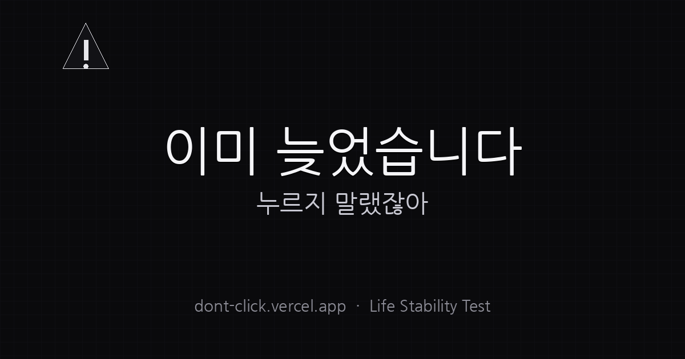

<p align="center">
  
</p>

<h1 align="center">이미 늦었습니다</h1>

<p align="center">
  누르지 말랬잖아 버튼을 누를수록 </br>
화면이 점점 망가지는 </br> 어이없는 웹사이트 </br> (도망 버튼 + 로그 + glitch + 망함지수)
</p>

<p align="center">
  <a href="https://already-late.vercel.app/">
    
  </a>
</p>

<p align="center">
  
  
  
  
  
  
</p>

---

## Project Overview

**이미 늦었습니다**는 버튼 하나로 사람을 빡치게(?) 만드는 초단순 밈 사이트입니다.  
처음엔 “누르지 마세요”라고 하면서도 결국 누르게 만들고
누르는 순간부터 화면이 점점 어두워지고 흔들리고
버튼은 도망가고
시스템 로그가 뜨고
커서가 느려지고
마지막엔 “그래도 잘 살고 있습니다.”로 끝납니다.

- 단일 페이지 인터랙션으로 “어이없음”을 만드는 UI/UX 실험
- Next.js App Router + Tailwind 기반의 빠른 프로토타이핑
- OG 이미지/메타데이터 세팅까지 포함한 배포용 완성 형태

---

## Live Demo

<p>
  <a href="https://already-late.vercel.app/">
    
  </a>
</p>

---

## Why This Project

재밌는 웹사이트는 보통 “큰 기능”이 아니라  
**사소한 상호작용을 끝까지 밀어붙이는 연출**에서 나온다고 생각했습니다.

- 버튼 하나로 “심리전” 만들기
- 단계별로 시각/행동 피드백을 누적시키기
- UX가 점점 불편해지는데도 끝까지 누르게 만들기

그걸 최소한의 코드로 구현해보는 게 목표였습니다.

---

## Core Features

- **Step-based Doom Progression**
  - 클릭 단계(step)에 따라 배경/애니메이션/연출이 점진적으로 변화

- **Runaway Button**
  - 일정 단계부터 버튼이 확률적으로 도망
  - 상단 메시지 영역을 피하도록 이동 범위 제한

- **System Logs**
  - “그럴듯한데 쓸데없는” 로그 출력으로 몰입감(?) 강화

- **Glitch Effect**
  - 클릭/특정 단계에서 화면이 순간적으로 흔들리며 깨지는 연출

- **Cursor Lag Illusion**
  - 실제 커서를 느리게 할 수 없어, 커서 잔상(trail)이 느리게 따라오는 방식으로 “느려진 느낌” 연출

- **망함 지수 Gauge**
  - 현재 단계 기반 진행률(%) 시각화

- **Ending + Reset + Share**
  - 엔딩 카드 노출
  - 리셋 버튼으로 처음부터 재시작
  - 현재 단계(`?s=`) 기반 공유 링크 복사

---

## System Architecture

- **Frontend**: Next.js(App Router) + React + TypeScript
- **Styling**: Tailwind CSS + globals.css(커스텀 glitch)
- **Deploy**: Vercel
- **SEO/Share**: Next.js `metadata` + Open Graph image (`public/og.png`)

---

## Open Graph (OG)

카톡/디코/노션 공유 시 썸네일이 뜨도록 OG 이미지와 메타데이터를 구성했습니다.

- `public/og.png`
- `src/app/layout.tsx`의 `metadata.openGraph`

---

## Project Structure

```bash
already-late/
 ├── public/
 │   ├── og.png
 │   ├── favicon.ico
 │   └── (assets...)
 ├── src/
 │   └── app/
 │       ├── globals.css
 │       ├── layout.tsx
 │       └── page.tsx

 ├── package.json
 └── README.md
```

---

## Getting Started

### 1) Clone
```
git clone https://github.com/Oh-Jisong/already-late.git
cd already-late
```

### 2) Install
```
npm install
```

### 3) Run Dev
```
npm run dev
```
* open: http://localhost:3000
---

## What I Learned
- Next.js(App Router)에서 metadata/OG 세팅까지 포함한 배포 플로우
- CSR/SSR hydration 이슈 원인 파악 및 회피(스타일 삽입 방식 정리)
- “작은 상호작용을 단계적으로 누적”하는 UI 연출 설계
- 버튼 이동/확률/구간 제한 등 단순 로직으로도 ‘게임 같은’ UX 만들기
- 공유 링크(?s=)를 이용한 가벼운 상태 공유 패턴

---

## Future Improvements
- [X] 엔딩 단계에서 “망함 보고서” 자동 생성 (무의미하게 진지한 분석)
- [X] 클릭/회피 성공 횟수 기반 점수화 & 랭킹(로컬스토리지)
- [X] BGM/효과음(단계별 음성/비프음)
- [X] 모바일 최적화(터치 도망 로직/뷰포트 대응)
- [X] 다양한 엔딩 분기(선택지/확률 기반)
